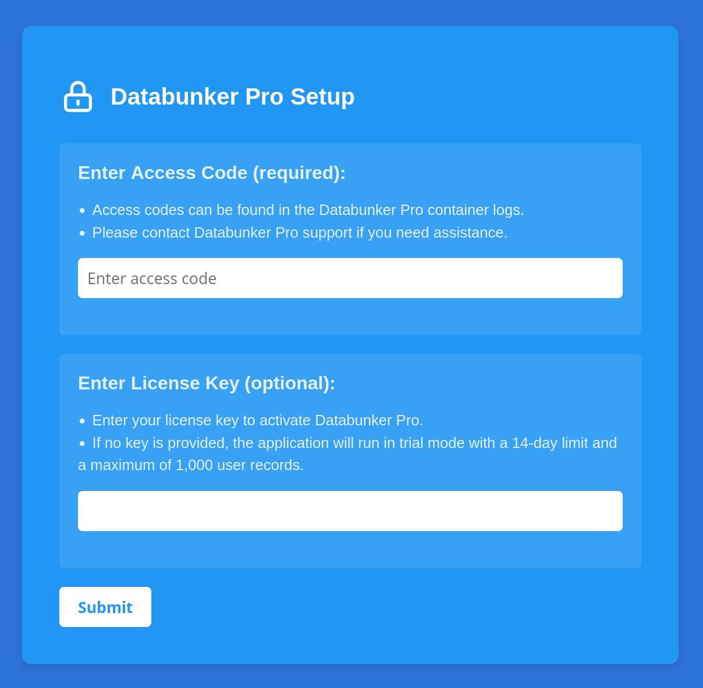
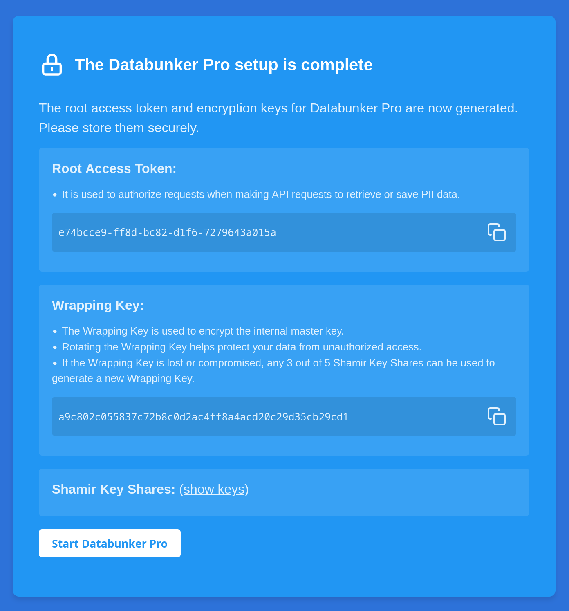

## Before you start

To complete this guide, you'll need:

- Databunker Pro installed
- _(Optional)_ A Databunker Pro License Key.

## Copy the generated access code from the logs

When Databunker Pro starts for the first time, it generates a six-digit access code and outputs it to the service logs.

For example, if you deployed Databunker Pro on Kubernetes, you can print the access code with the following command line:

```sh
kubectl logs deployment/databunkerpro | grep "Access code"
```

## Complete the setup in your browser

To complete the setup, you'll need access to the Databunker Pro web interface from your browser.

<Steps>
<Step title="Open the web interface in your browser">
By default, the web interface is exposed on port 3000.
</Step>

<Step title="Submit access code and license key">

[Book a call](https://cal.com/databunker-team/30min) to purchase a license key, or leave empty to run Databunker Pro in Trial mode.



</Step>
<Step title="Copy the generated secrets">

Copy the following secrets from the page and store them securely:

- Root Access Token
- Wrapping Key
- Shamir Key Shares



</Step>
<Step title="Start Databunker Pro">

Finally, click **Start Databunker Pro** to start the service.

</Step>
</Steps>

Databunker Pro is now running and ready to use.
